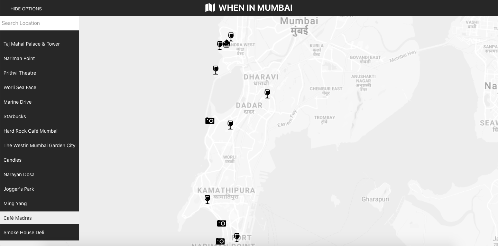

# WHEN IN MUMBAI [Neighbourhood-Maps-React]
This is the final project in the Front-End Developer Nanodegree by Udacity. The purpose of this project is to make a listing of famous locations
Mumbai using Google Maps API and FourSquare API. 

## Getting Started
These instructions will get you a copy of the project up and running on your local machine for development and testing purposes. See deployment for notes on how to deploy the project on a live system.

## Installing
After cloning or downloading the project start by installing all the node_modules use
`npm install ` to install all the dependencies.

## Starting the project
To start the project run `npm start` from the terminal.

## Built With
* [React](https://reactjs.org/) - React Front-End Framework.
* [Google Maps API](https://developers.google.com/maps/documentation/) - Google Maps API.
* [FourSquare API](https://developer.foursquare.com/) - FourSquare API.
* [Sass](https://sass-lang.com/) - Sass

# ScreenShots

### Desktop

### InfoWindow

### Mobile view

### Mobile view-options
